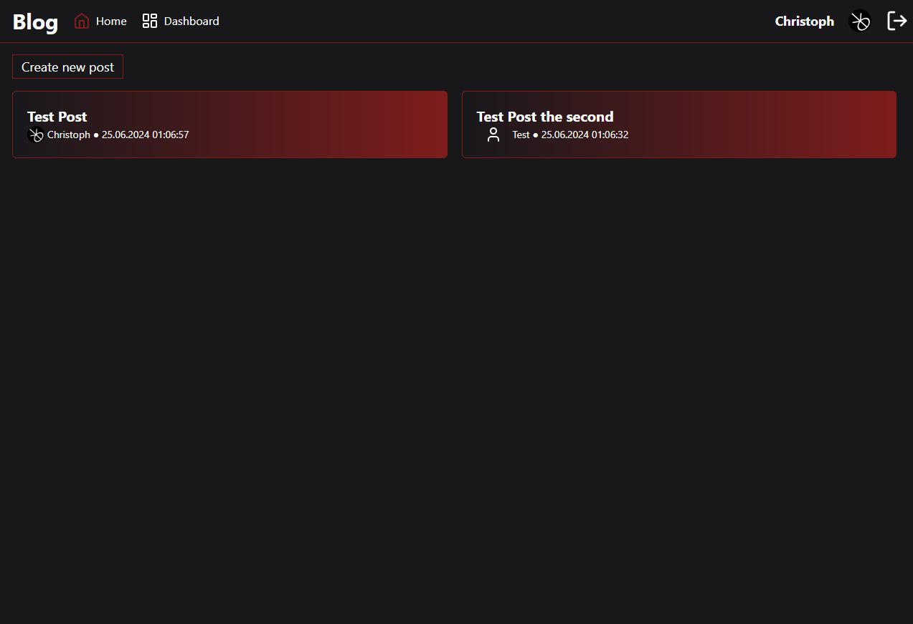
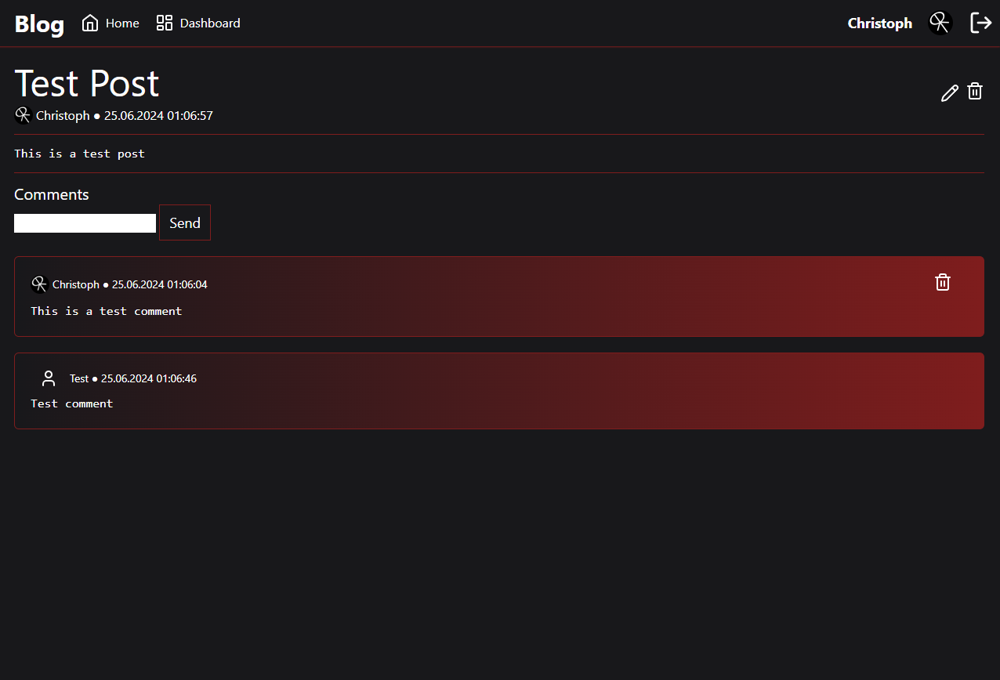

# Symfony Blog

A small project to learn a bit about symfony.

## Development

### Install dependencies
```bash
composer install
pnpm install
```

### Start database, build js and start webserver
```bash
docker compose up
pnpm run watch
symfony server:start
```

### Migrate database (only first start or after db changes)

```bash
# Create migration (only after changes)
symfony console make:migration

# Migrate
symfony console doctrine:migrations:migrate
```

## Roles

For testing purposes, there are two routes that change the current user's role.

- _/makeMeAdmin_
- _/makeMeUser_

## Screenshots

### Home



### Post



### Dashboard

